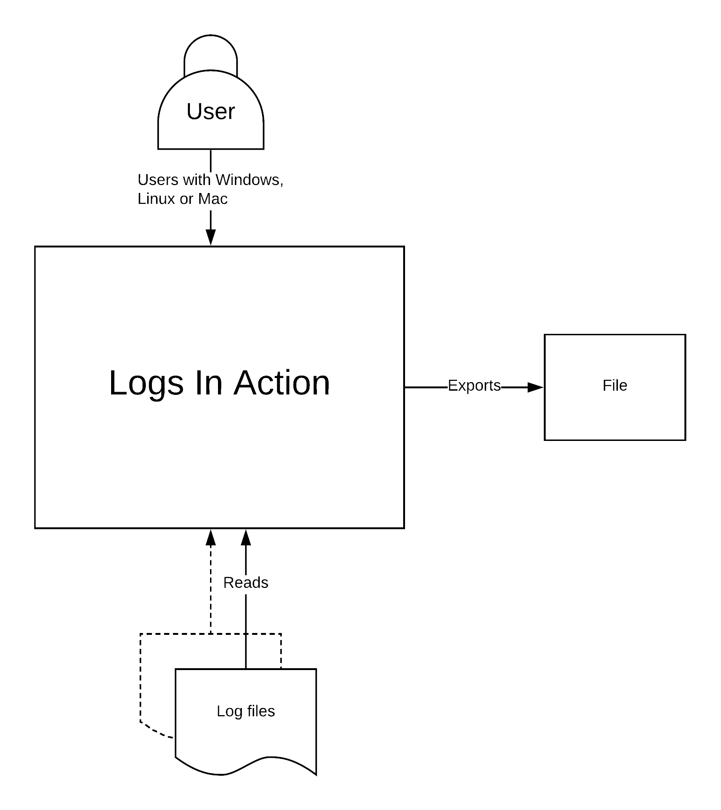
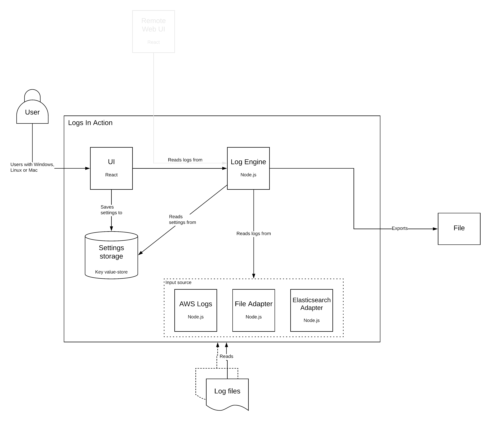
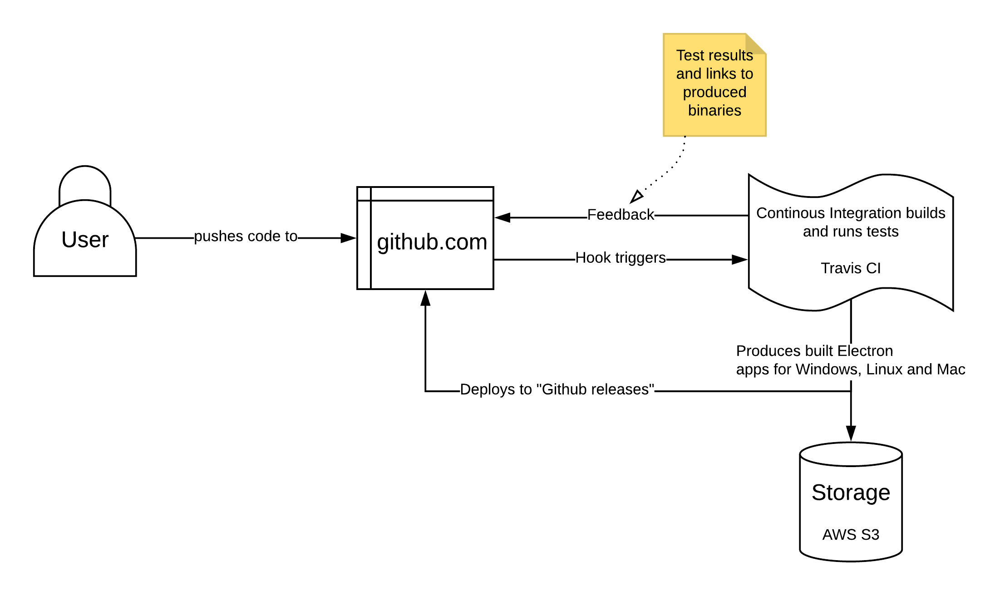

# Logs In Action

## How to develop
Node version used: `8.4.0`, others (newer versions) may work as well.

Start with running `npm install`.

Run `npm test` to run tests.

Run `npm run lint` to check for code errors

## Useful links

*Learn Javascript and Node*
- [Learn Node - Learning Path](https://developer.ibm.com/series/learn-node-learning-path)
- [JavaScript 30](https://javascript30.com)
- [Node JS Docs](https://nodejs.org/docs)
- [How to Learn React — A roadmap from beginner to advanced](https://medium.freecodecamp.org/learning-react-roadmap-from-scratch-to-advanced-bff7735531b6)

*Test*
- [Mocha](https://mochajs.org)
- [Chai JS](https://www.chaijs.com)

*Code style & lint*
- [Prettier](https://prettier.io)
- [ESLint](https://eslint.org)

*...more*
- [Electron](https://electronjs.org/)
- [Travis CI](https://docs.travis-ci.com)
- [React](https://reactjs.org/docs/getting-started.html)
- [Webpack](https://webpack.js.org/)
- [How to use package.json scripts as build tool](https://scotch.io/tutorials/using-npm-as-a-build-tool)
- [Awesome Electron Links](https://github.com/sindresorhus/awesome-electron)

## Project Overview
#### Context

#### Containers

#### Continous Integration

